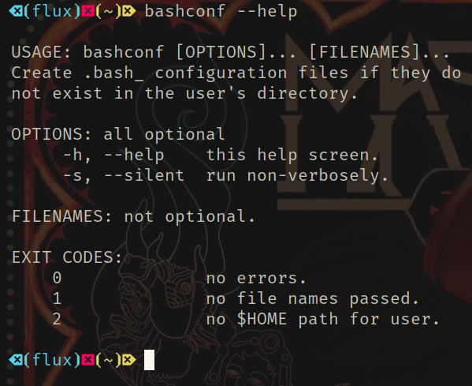
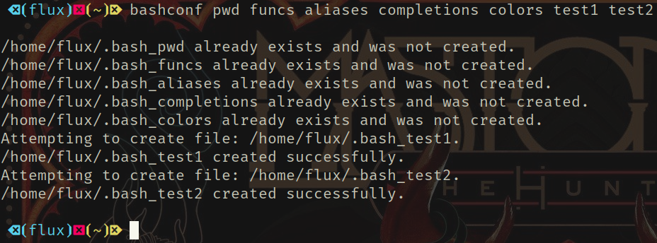
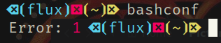

# bashconf

    

## Index

1. [Description](#description)
2. [Motivation](#motivation)
3. [Usage](#usage)
4. [Files](#files)
   1. [Source Files](#source)
   2. [All Project Files](#project)
   3. [Binary](#binary)
   4. [AppImage](#appimage)
   5. [Bash Completion](#bashcompletion)
   6. [This Repository](#repository)
   7. [Release Page](#release)
5. [Media](#media)
6. [License](#license)

## Description <a  id="description"></a>

> Create .bash_&lt;NAME&gt; configuration files in the user's directory if they don't exist with some error/exit codes. 

## Motivation <a  id="motivation"></a>

> I set up lots of VM's and machines and I setup lots of ***Bash*** conguration files and this helps automate the process.

## Usage <a  id="usage"></a>

> This is a command line interface binary executable and can be ran with any method that you can run any other program; command line, [Alt+F2] (Run), scripts, and other programs...

```Bash
 $ # If in path
 $ bashconf pwd funcs aliases completions colors test1 test2

/home/<USERNAME>/.bash_pwd already exists and was not created.
/home/<USERNAME>/.bash_funcs already exists and was not created.
/home/<USERNAME>/.bash_aliases already exists and was not created.
/home/<USERNAME>/.bash_completions already exists and was not created.
/home/<USERNAME>/.bash_colors already exists and was not created.
Attempting to create file: /home/<USERNAME>/.bash_test1.
/home/<USERNAME>/.bash_test1 created successfully.
Attempting to create file: /home/<USERNAME>/.bash_test2.
/home/<USERNAME>/.bash_test2 created successfully.

 $ bashconf --help

 USAGE: bashconf [OPTIONS]... [FILENAMES]...
 Create .bash_ configuration files if they do 
 not exist in the user's directory.

 OPTIONS: all optional
      -h, --help    this help screen.
      -s, --silent  run non-verbosely.

 FILENAMES: not optional.

 EXIT CODES:
     0              no errors.
     1              no file names passed.
     2              no $HOME path for user.

```

## Files <a  id="files"></a>

- [Source Files](source.tar.gz) <a id="source"></a>
- [Project Files](https://github.com/Lateralus138/bashconf/archive/Continuous.tar.gz) <a id="project"></a>
- [Binary Executable](https://github.com/Lateralus138/bashconf/releases/download/Continuous/bashconf) <a id="binary"></a>
- [AppImage](https://github.com/Lateralus138/bashconf/releases/download/Continuous/bashconf-x86_64.AppImage) <a id="appimage"></a>
  - Can be renamed.
- [Bash Completion](bash/bashconf-completion.bash) <a id="bashcompletion"></a>
  - Can be sourced or you can copy the "complete" section to your dot file.
- [This Repository](https://github.com/Lateralus138/bashconf) <a id="repository"></a>
- [Release Page](https://github.com/Lateralus138/bashconf/releases/latest) <a id="release"></a>

## Media <a  id="media"></a>

### Help Screen



### Create files



### Errors

> No file names passed.



## [License](./LICENSE) <a  id="license"></a>

>This program is free software: you can redistribute it and/or modify it under the terms of the GNU General Public License as published by the Free Software Foundation, either version 3 of the License, or (at your option) any later version.

>This program is distributed in the hope that it will be useful, but WITHOUT ANY WARRANTY; without even the implied warranty of MERCHANTABILITY or FITNESS FOR A PARTICULAR PURPOSE.  See the GNU General Public License for more details.
